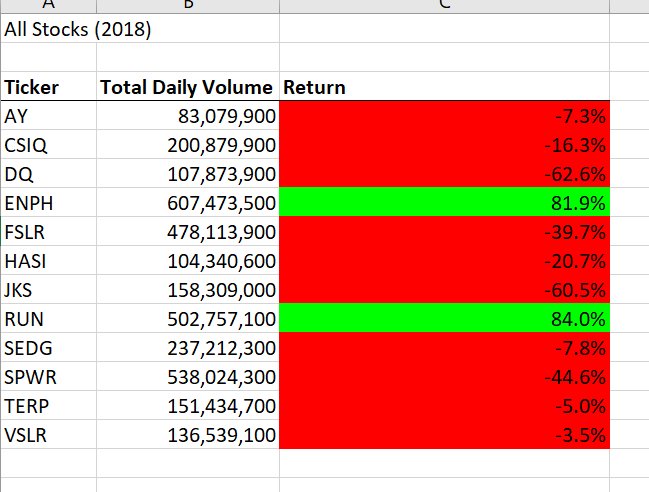
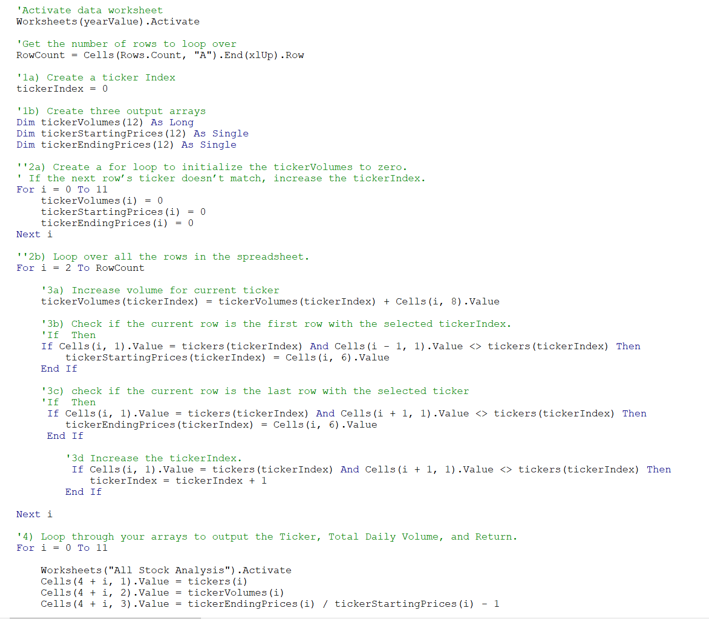
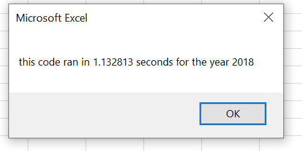
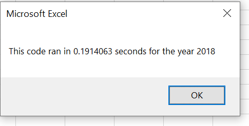

# VBA Challenge
## Overview of Project
Refactored analysis performed using Stock data to help inform a couple interested in investing in Green Energy to now analyze across thousands of stocks.

### Purpose

*The purpose of this project is to show how different stocks performed against the stock the couple is interested in investing in (“DAQO”) by finding total yearly return for each stock, total daily volume and how each stock performed in various years. We are refactoring our initial code to run more efficiently, use less memory and improve the code logic to be more user friendly.

## Analysis 
### Original code 
We had originally set out to analyze how investing in DQ was worth while for our Steve’s parents by comparing their yearly returns of 2017 and 2018. Based on our results below, we can see that DQ was not a wise investment and many Green Energy Stocks suffered in 2018.

 

### Refactoring All Stocks Analysis Code
Now that we have mastered analysis stock performance for the 12 stocks in questions, we were tasked with refactoring our code to handle larger data sets in a more efficient manner. By creating a new variable, tickerIndex, we were able easily analyze datae across arrays tickerVolumes, tickerStartingPrices and tickerEndingPrices. 

 

By creating these variables and arrays we were able to loop through the information we needed to get our results faster. Our original code has a run time of just over 1 seconds, whereas our refactored code was able to get the job done in under .2 seconds.

## Summary
### Pros and Cons of refactoring code
####Pros
There are many advantages of refactoring VBA code. By making a few small edits we have made our code cleaner and more organized while running at a fraction of the original speed. Our refactored code is more user accessible and easy to comprehend should there be any changes necessary in the future.

####Cons
While refactoring code can be widely beneficial, it can also be extremely time consuming. Refactoring code, like most coding, requires a keen attention to detail. By changing the code, we are introducing potential new bugs that we may not catch which will lead to a longer work around time.

###related to All Stocks Analysis
By tweaking our code slightly, we were to shave nearly a whole second off our original run time. This opens the door for Steve to run our program for a variety of stocks his parents may have interest in down the line. We have made the code more organized to follow should their invest decisions change down the line.

